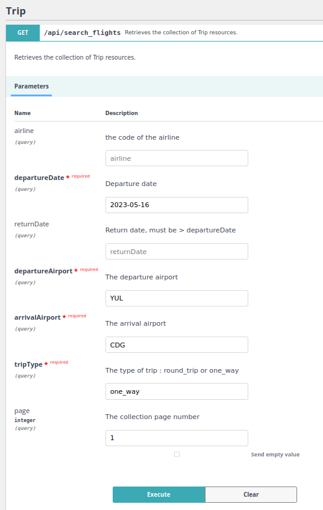

### The Trip Builder

The only interface is through ApiPlatform interface, where you'll be able to
see and play with the filters :


#### Example 1 : one way

Url request :
http://localhost:8080/api/search_flights?departureDate=2023-05-16&departureAirport=YUL&arrivalAirport=CDG&tripType=one_way&page=1

Request : 

```json
{
  "departureDate": "2023-05-16",
  "departureAirport": "YUL",
  "arrivalAirport": "CDG",
  "tripType": "one_way"
}

```
Response (it's json-ld) : 

```json
{
  "@context": "/api/contexts/Trip",
  "@id": "/api/search_flights",
  "@type": "hydra:Collection",
  "hydra:member": [
    {
      "@id": "/api/trips/6463b4fe2cfc0",
      "@type": "Trip",
      "id": "6463b4fe2cfc0",
      "price": 1458.25,
      "flights": [
        {
          "@type": "FlightDto",
          "airline": "AF",
          "number": 661,
          "departureAirport": "YUL",
          "arrivalAirport": "CDG",
          "departureDateTime": "2023-05-16T21:00:00+00:00",
          "arrivalDateTime": "2023-05-17T03:50:00+00:00",
          "price": 1458.25
        }
      ]
    }
  ],
  "hydra:totalItems": 1,
  "hydra:view": {
    "@id": "/api/search_flights?departureDate=2023-05-16&departureAirport=YUL&arrivalAirport=CDG&tripType=one_way",
    "@type": "hydra:PartialCollectionView"
  }
}

```

#### Example 2 : round trip
Url request : 
http://localhost:8080/api/search_flights?airline=AC&departureDate=2023-05-16&returnDate=2023-06-15&departureAirport=YUL&arrivalAirport=YVR&tripType=round_trip&page=1
Request :

```json
{
  "departureDate": "2023-05-16",
  "returnDate": "2023-06-18",
  "departureAirport": "YUL",
  "arrivalAirport": "YVR",
  "tripType": "round_trip"
}

```
Response (it's json-ld) :

```json
{
  "@context": "/api/contexts/Trip",
  "@id": "/api/search_flights",
  "@type": "hydra:Collection",
  "hydra:member": [
    {
      "@id": "/api/trips/6463b627a3e17",
      "@type": "Trip",
      "id": "6463b627a3e17",
      "price": 493.86,
      "flights": [
        {
          "@type": "FlightDto",
          "airline": "AC",
          "number": 301,
          "departureAirport": "YUL",
          "arrivalAirport": "YVR",
          "departureDateTime": "2023-05-16T11:35:00+00:00",
          "arrivalDateTime": "2023-05-16T17:05:00+00:00",
          "price": 273.23
        },
        {
          "@type": "FlightDto",
          "airline": "AC",
          "number": 302,
          "departureAirport": "YVR",
          "arrivalAirport": "YUL",
          "departureDateTime": "2023-06-18T18:30:00+00:00",
          "arrivalDateTime": "2023-06-18T23:11:00+00:00",
          "price": 220.63
        }
      ]
    }
  ],
  "hydra:totalItems": 1,
  "hydra:view": {
    "@id": "/api/search_flights?airline=AC&departureDate=2023-05-16&returnDate=2023-06-18&departureAirport=YUL&arrivalAirport=YVR&tripType=round_trip",
    "@type": "hydra:PartialCollectionView"
  }
}

```

### Installation

This projects runs through the following services in production.

- PHP 8.1
- Nginx 1.17
- PostgreSql 15
- Git

But you'll only need to install this tools to reproduce the same environment easily - as it's dockerized:

- [Docker](https://www.docker.com/)
- [Docker Compose](https://docs.docker.com/compose/overview/)


Clone the project repository 
```bash 
git clone git@github.com:SophieJager/flighthub.git
````
Go to root project with your terminal and run command :

```bash
make install
```

These command will just clone the project repository, setup a whole dev environment through docker machines (one by entry 
in the `docker-compose.yml` file) and setup database structure with migrations, and fill it with datas through fixtures.

You'll certainly be prompted for some consumer key / secret from git during composer install. Just generate and tape it, it'll not ask again.

https://docs.docker.com/engine/install/linux-postinstall/

A single command allows you to run the project:

```sh
make start
```

If you run `make status` after that, you'll see the corresponding list of containers that
are running.

App instance runs on 8080 port, you can access it on `http://localhost:8080/api`.

If you need to stop all project containers, just use:

```sh
make stop
```